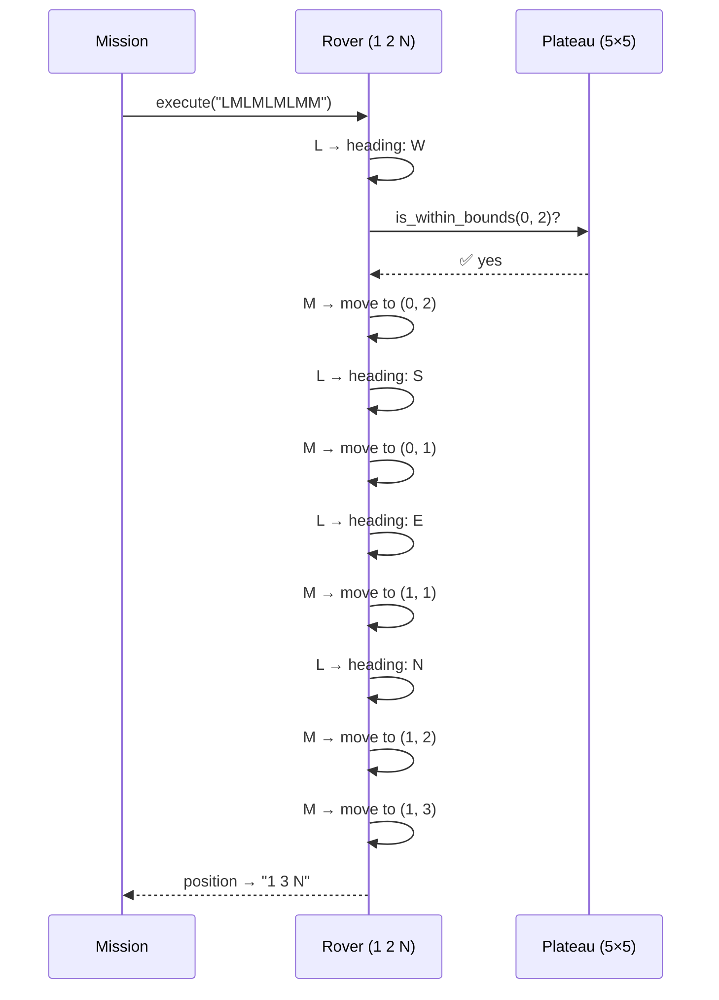
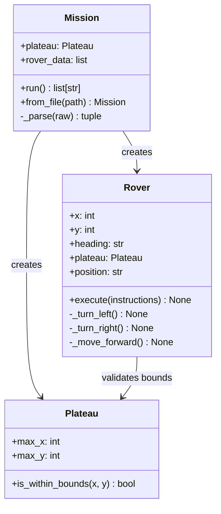

# Mars Rover Problem 🚀

## Goals

The aim of this project is to solve the classic NASA Mars Rover kata using
Python and Object-Oriented Programming principles. It demonstrates clean
architecture (Single Responsibility), thorough test coverage, and a
production-ready CI pipeline.

## Overview

### Language & Stack

[](https://www.python.org/)
[](https://pytest.org/)
[](https://docs.astral.sh/ruff/)
[](https://github.com/imanemessak/mars-rover-problem/actions/workflows/ci.yml)

### Questions

[:speech_balloon: Ask a question](https://github.com/imanemessak/mars-rover-problem/issues/new)
[:book: Read the questions](https://github.com/imanemessak/mars-rover-problem/issues/)

**Contribution**

[](CODE_OF_CONDUCT.md)

---

## Problem Statement

A squad of robotic rovers are landed by NASA on a rectangular plateau on Mars.
The plateau is divided into a grid. Each rover's position is represented by
`x y HEADING` — two integer coordinates and a cardinal direction
(`N`, `E`, `S`, `W`).

NASA controls each rover by sending a string of single-letter instructions:

| Instruction | Effect |
|---|---|
| `L` | Spin 90° left (no movement) |
| `R` | Spin 90° right (no movement) |
| `M` | Move forward one grid point in the current heading |

The square directly North of `(x, y)` is `(x, y+1)`. Rovers are deployed and
executed **sequentially** — the second rover does not move until the first has
finished.

**Test Input:**
```
5 5        ← plateau upper-right corner (lower-left is always 0,0)
1 2 N      ← rover 1 initial position
LMLMLMLMM  ← rover 1 instructions
3 3 E      ← rover 2 initial position
MMRMMRMRRM ← rover 2 instructions
```

**Expected Output:**
```
1 3 N
5 1 E
```

***

## Approach

The solution is applied by creating three classes, each
with a single, well-defined responsibility (Single Responsibility Principle).

### Classes

| Class | File | Responsibility |
|---|---|---|
| `Plateau` | `plateau.py` | Holds grid dimensions, validates whether a coordinate is in bounds |
| `Rover` | `rover.py` | Encapsulates position and heading; processes `L`, `R`, `M` instructions |
| `Mission` | `mission.py` | Parses raw text input, creates the plateau, deploys rovers sequentially |

### Key design decisions

- **Rotation via modular indexing**

    Directions are stored as `["N", "E", "S", "W"]`
    in clockwise order. Turning left/right is `(index ± 1) % 4`, removing all
    `if/elif` chains.
- **Plateau injected into Rover**

    `Rover` does not know the grid size itself;
    it delegates bound-checking to `Plateau`. This keeps responsibilities clean
    and makes each class independently testable.
- **Mission as Facade** 

    `Mission` is the only class that knows about both
    `Plateau` and `Rover`. All parsing logic is isolated there, so `Rover` and
    `Plateau` stay pure domain objects.

### How a rover processes `LMLMLMLMM`



### Full dependency flow



***

## Architecture

```
src/mars_rover/
├── plateau.py    # Plateau — grid boundary validation
├── rover.py      # Rover   — movement & rotation logic
├── mission.py    # Mission — input parsing & sequential orchestration
└── __main__.py   # CLI entry point
```

***

## Setup

Make sure you have Python 3.10+ installed, then:

```bash
# Clone the repository
git clone https://github.com/imanemessak/mars-rover-problem.git
cd mars-rover-problem

# Create and activate a virtual environment
python3 -m venv .venv
source .venv/bin/activate

# Install in editable mode with dev dependencies
pip install -e ".[dev]"
```

***

## Run

```bash
# Run against an input file
python -m mars_rover examples/input.txt

# Or using the installed CLI command
mars-rover examples/input.txt
```

***

## Docker

```bash
# Pull the latest image
docker pull ghcr.io/imanemessak/mars-rover-problem:latest

# Run against a local input file
docker run --rm -v $(pwd)/examples:/data \
  ghcr.io/imanemessak/mars-rover-problem:latest /data/input.txt
```

***

## Test

```bash
# Run all tests
pytest

# Run with coverage report
pytest --cov=mars_rover --cov-report=term-missing

# Run a specific test file
pytest tests/test_rover.py -v
```

The test suite covers **55 cases** across three files:

| File | Scope |
|---|---|
| `test_plateau.py` | Boundary validation, construction errors, parametrized coordinates |
| `test_rover.py` | Turning, moving, acceptance tests, edge cases, error cases |
| `test_mission.py` | Parsing, sequential execution, whitespace tolerance, file I/O |

***

## Lint

```bash
ruff check src/ tests/
```

***

## CI

GitHub Actions runs on every push and pull request to `main` / `dev`.

| Job | Tool | Trigger |
|---|---|---|
| 💎 Quality | Ruff lint + format check | all branches |
| 🛡️ Security | Bandit (SAST) + Safety (CVEs) | all branches |
| 🤖 Tests | pytest + Codecov (Python 3.11, 3.12, 3.13) | after quality |
| 🛠️ Build | wheel + sdist verified with Twine | after tests + security |
| 🐳 Docker | build & push to ghcr.io | after build |
| 📤 Release | python-semantic-release | after build, `main` only |

See [`.github/workflows/ci.yml`](.github/workflows/ci.yml).

***

## Contributing

Please see the [CONTRIBUTING](CONTRIBUTING.md) file.

## Contributor Code of Conduct

Please note that this project is released with a
[Contributor Code of Conduct](https://www.contributor-covenant.org/).
By participating in this project you agree to abide by its terms.
See [CODE_OF_CONDUCT](CODE_OF_CONDUCT.md).

## Licence

This work is licensed under a
[Creative Commons Attribution-ShareAlike 4.0 International License][cc-by-sa].

[![CC BY-SA 4.0][cc-by-sa-image]][cc-by-sa]

[cc-by-sa]: http://creativecommons.org/licenses/by-sa/4.0/
[cc-by-sa-image]: https://licensebuttons.net/l/by-sa/4.0/88x31.png